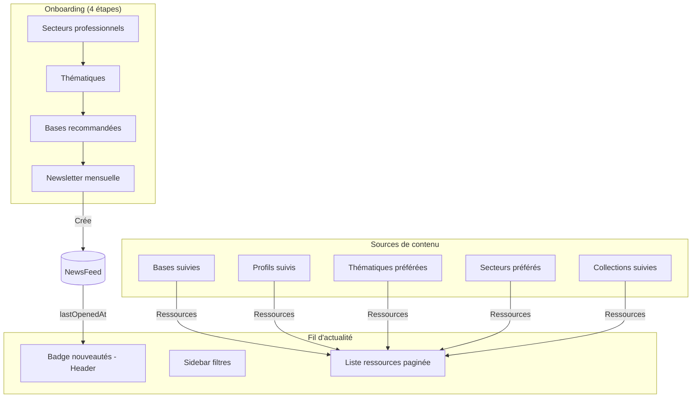

# ADR-001 : Fil d'actualité personnalisé

## Auteurs et historique

| Date | Auteur | Action |
|------|--------|--------|
| 2025-11-25 | Hugues Maignol | Rédaction initiale de l'ADR |

## Statut

Accepté

## Contexte

La plateforme "Les Bases" permet aux utilisateurs de créer, partager et découvrir des ressources. La découverte reposait jusqu'ici sur la recherche manuelle et la navigation dans les bases/profils suivis.

**Besoins identifiés** :
1. Un flux personnalisé présentant automatiquement les nouvelles ressources pertinentes
2. Une personnalisation transparente sans algorithme opaque
3. Un suivi visuel des nouveautés depuis la dernière visite
4. Une newsletter mensuelle optionnelle

## Décision

Implémenter un fil d'actualité basé sur les préférences explicites de l'utilisateur, avec comptage des nouveautés et onboarding guidé.

### Architecture globale

### Modèle de données

**Table `NewsFeed`** (voir [schema.prisma](../../apps/web/prisma/schema.prisma)) :

| Champ | Description |
|-------|-------------|
| `userId` | Clé primaire, référence utilisateur |
| `professionalSectors` | Secteurs professionnels sélectionnés |
| `themes` | Thématiques sélectionnées |
| `monthlyNewsletter` | Opt-in newsletter |
| `lastOpenedAt` | Dernière consultation (calcul nouveautés) |
| `hasCompleteOnboarding` | Onboarding terminé |

---

## 1. Onboarding des préférences

### Parcours

L'onboarding se déclenche si l'utilisateur n'a pas de `NewsFeed` en base.

| Étape | Description | Fichier |
|-------|-------------|---------|
| 1. Secteurs | Sélection multiple de secteurs professionnels | [NewsFeedProfessionnalsSectorsPage.tsx](../../apps/web/src/features/fil-d-actualite/onboarding/professionals-sectors/NewsFeedProfessionnalsSectorsPage.tsx) |
| 2. Thématiques | Sélection multiple (recommandé: min 3) | [NewsFeedThemesPage.tsx](../../apps/web/src/features/fil-d-actualite/onboarding/themes/NewsFeedThemesPage.tsx) |
| 3. Bases | Suggestion de bases pertinentes à suivre | [NewsFeedBasesPage.tsx](../../apps/web/src/features/fil-d-actualite/onboarding/bases/NewsFeedBasesPage.tsx) |
| 4. Newsletter | Activation du résumé mensuel | [NewsFeedResumePage.tsx](../../apps/web/src/features/fil-d-actualite/onboarding/resume/NewsFeedResumePage.tsx) |

### Recommandation des bases

Logique dans [getRecommendedBasesToFollow.ts](../../apps/web/src/features/fil-d-actualite/db/getRecommendedBasesToFollow.ts) :

- **Avec préférences** : Bases ayant le plus de ressources correspondant aux thématiques/secteurs choisis
- **Sans préférences** : Bases les plus populaires (par vues) non encore suivies

### Comportements clés

- **Redirection automatique** : Header → onboarding si pas de `NewsFeed` (voir [Header.tsx](../../apps/web/src/components/Header.tsx))
- **Skip possible** : Crée un `NewsFeed` vide avec `hasCompleteOnboarding: false`
- **Modification** : Page `/fil-d-actualite/preferences` accessible à tout moment

---

## 2. Layout et pagination

### Structure

| Zone | Contenu |
|------|---------|
| Sidebar gauche | Filtres : thématiques, secteurs, bases suivies, profils suivis |
| Contenu principal | Header contextuel + liste ressources + pagination |

Layout principal : [layout.tsx](../../apps/web/src/app/fil-d-actualite/(fil-actualite)/layout.tsx)

### Filtrage par URL

Le segment d'URL encode le filtre actif :

| URL | Affichage |
|-----|-----------|
| `/fil-d-actualite/tout` | Tout le fil |
| `/fil-d-actualite/thematique=Education` | Thématique Éducation |
| `/fil-d-actualite/secteur=Collectivite` | Secteur Collectivités |
| `/fil-d-actualite/base=ma-base` | Base spécifique |
| `/fil-d-actualite/suivis=tout` | Bases et profils suivis uniquement |

Parsing : [newsFeedUrls.ts](../../apps/web/src/server/newsFeed/newsFeedUrls.ts)

### Pagination "Voir plus"

- **Initial** : 20 ressources (SSR)
- **Chargement suivant** : Via tRPC, accumulation dans la liste
- **Hook** : [useNewsFeedPagination.ts](../../apps/web/src/hooks/useNewsFeedPagination.ts)

---

## 3. Compteur de nouveautés (Badge Header)

### Principe

Badge numérique indiquant les ressources non consultées depuis `lastOpenedAt`.

### Calcul

Une ressource est "nouvelle" si :
1. Date d'activité > `lastOpenedAt`
2. Non vue (pas dans `resource_views`) OU modifiée depuis dernière vue

Requête SQL : [getNewsFeedResources.ts → getFollowedUnseenResourcesCount](../../apps/web/src/server/newsFeed/getNewsFeedResources.ts)

### Mise à jour

| Événement | Action |
|-----------|--------|
| Visite du fil | `lastOpenedAt` mis à jour via [UpdateNewsLastOpenedAt.tsx](../../apps/web/src/features/fil-d-actualite/components/UpdateNewsLastOpenedAt.tsx) |
| Polling 5 min | Rafraîchissement automatique du badge |
| Navigation | Invalidation cache tRPC via [NewsFeedBadgeInvalidation.tsx](../../apps/web/src/features/fil-d-actualite/components/NewsFeedBadgeInvalidation.tsx) |

Composant badge : [NewsFeedBadge.tsx](../../apps/web/src/features/fil-d-actualite/components/NewsFeedBadge.tsx)

---

## 4. Listing des ressources

### Sources de contenu

| Source | Description |
|--------|-------------|
| Base suivie | Ressource publiée par une base suivie |
| Profil suivi | Ressource créée par un profil suivi |
| Thématique | Correspond à une thématique préférée |
| Secteur professionnel | Correspond à un secteur préféré |
| Collection de base/profil | Ressource ajoutée à une collection suivie |

### Types d'événements

1. **Publication** : Nouvelle ressource
2. **Mise à jour** : Ressource republiée
3. **Ajout en collection** : Ressource sauvegardée dans une collection publique

### Requêtes SQL

Toute la logique de récupération est dans [getNewsFeedResources.ts](../../apps/web/src/server/newsFeed/getNewsFeedResources.ts) :

- `getResourceIds` : Récupération paginée avec filtres
- `getFollowedResourceIds` : Variante pour le filtre "suivis uniquement"
- `countNewsFeedResources` : Comptages par filtre pour la sidebar

**Principe** : Requêtes avec CTEs (Common Table Expressions) pour agréger les sources, dédupliquer, et marquer l'état vu/non-vu.

### Attribution de la source

Chaque ressource affiche pourquoi elle apparaît dans le fil. Priorité d'affichage :
1. Collection → 2. Base suivie → 3. Profil suivi → 4. Thématique → 5. Secteur

Logique : [NewsFeedOwnershipInformation.tsx](../../apps/web/src/features/fil-d-actualite/components/NewsFeedOwnershipInformation.tsx)

---

## Alternatives considérées

### Alternative 1 : Notifications temps réel (WebSocket)

**Principe** : Mettre à jour le badge instantanément via WebSocket quand une nouvelle ressource est publiée.

**Avantages** :
- Badge toujours à jour
- Meilleure UX pour les utilisateurs très actifs

**Inconvénients** :
- Infrastructure WebSocket à mettre en place et maintenir
- Complexité de gestion des reconnexions, sessions multiples
- Nécessite de tracker quels utilisateurs sont concernés par chaque publication

**Raison du rejet** : Le polling toutes les 5 minutes est un bon compromis. L'urgence de voir une nouvelle ressource n'est pas critique (contrairement à un chat ou des notifications transactionnelles). Le coût d'infrastructure et de maintenance ne se justifie pas.

### Alternative 2 : Feed pré-calculé (Materialized View / Table dédiée)

**Principe** : Pré-calculer et stocker le fil de chaque utilisateur dans une table dédiée `user_feed_items`.

**Avantages** :
- Lectures très rapides (simple SELECT)
- Pas de jointures complexes à chaque affichage

**Inconvénients** :
- **Fan-out à l'écriture** : Chaque publication doit être insérée dans le fil de tous les utilisateurs concernés
- **Stockage** : Duplication massive des données
- **Complexité de mise à jour** : Si un utilisateur change ses préférences, il faut recalculer tout son fil
- **Suppression/modification** : Propager les changements à tous les fils concernés

**Raison du rejet** : La volumétrie actuelle (quelques milliers d'utilisateurs, quelques publications par jour) ne justifie pas cette complexité. Les requêtes SQL avec CTEs restent performantes (<100ms). Cette approche serait pertinente à l'échelle Twitter/Instagram, pas pour notre cas d'usage.

### Alternative 3 : Algorithme de recommandation ML

**Principe** : Utiliser du machine learning pour personnaliser le fil selon le comportement (clics, temps passé, etc.).

**Avantages** :
- Personnalisation plus fine
- Découverte de contenus inattendus

**Inconvénients** :
- **Opacité** : L'utilisateur ne comprend pas pourquoi il voit telle ressource
- **Effet bulle de filtre** : Renforcement des biais
- **Complexité** : Infrastructure ML, collecte de données comportementales
- **Contraire à nos valeurs** : Transparence et contrôle utilisateur

**Raison du rejet** : Philosophie du produit. L'utilisateur doit comprendre et contrôler ses sources de contenu. Chaque ressource affiche explicitement sa provenance.

---

## Choix actuel

### Avantages

- **Transparence** : L'utilisateur contrôle ses sources, chaque ressource explique sa présence
- **Simplicité** : Pas d'infrastructure supplémentaire (WebSocket, cache Redis, jobs asynchrones)
- **Performance suffisante** : Requêtes SQL optimisées, pagination serveur
- **Évolutivité** : Facile d'ajouter de nouveaux types de filtres/sources

### Inconvénients

- **Complexité SQL** : Requêtes avec CTEs multiples, maintenance délicate
- **Polling** : Badge pas temps réel (délai max 5 min)
- **Dépendance onboarding** : Fil vide sans préférences ni follows

---

## Références

| Fichier | Description |
|---------|-------------|
| [schema.prisma](../../apps/web/prisma/schema.prisma) | Modèle NewsFeed |
| [getNewsFeedResources.ts](../../apps/web/src/server/newsFeed/getNewsFeedResources.ts) | Requêtes SQL principales |
| [newsFeedRouter.router.ts](../../apps/web/src/server/rpc/news-feed/newsFeedRouter.router.ts) | API tRPC |
| [NewsFeedPage.tsx](../../apps/web/src/features/fil-d-actualite/NewsFeedPage.tsx) | Page principale |
| [NewsFeedList.tsx](../../apps/web/src/features/fil-d-actualite/NewsFeedList.tsx) | Liste avec pagination |
| [NewsFeedBadge.tsx](../../apps/web/src/features/fil-d-actualite/components/NewsFeedBadge.tsx) | Badge header |

---

**Note** : Cet ADR documente une décision d'architecture déjà implémentée. Il a été rédigé a posteriori pour formaliser les choix techniques et faciliter l'onboarding de nouveaux développeurs.

